# System Context View

## External Actors and Systems

### Human Users
**[FACT]** Users interact via:
- Chat platforms (Telegram, Discord, Slack, etc.)
- CLI (direct terminal interaction)
- Email (IMAP/SMTP)

**[FACT]** User identification:
- Platform-specific IDs (user_id, username, email)
- Allowlist-based access control
- No authentication beyond platform auth

### Chat Platforms (11 Channels)

**[FACT]** Supported platforms from `nanobot/channels/`:

1. **Telegram** (`telegram.py`)
   - Bot API via python-telegram-bot
   - WebSocket or polling
   - Media support (images, audio, documents)

2. **Discord** (`discord.py`)
   - Gateway WebSocket API
   - Direct messages + guild channels
   - Mention-based group policy

3. **Slack** (`slack.py`)
   - Socket Mode (WebSocket)
   - Thread support
   - Emoji reactions

4. **WhatsApp** (`whatsapp.py`)
   - Via custom Node.js bridge
   - QR code authentication
   - Media forwarding

5. **Feishu/Lark** (`feishu.py`)
   - WebSocket long connection
   - Group mention policy
   - Emoji reactions

6. **DingTalk** (`dingtalk.py`)
   - Stream mode
   - Enterprise integration

7. **Email** (`email.py`)
   - IMAP (receive) + SMTP (send)
   - Polling-based
   - Consent-required

8. **Matrix/Element** (`matrix.py`)
   - E2EE support
   - Homeserver connection
   - Room-based messaging

9. **Mochat** (`mochat.py`)
   - Socket.io connection
   - Session/panel based
   - Custom mention rules

10. **QQ** (`qq.py`)
    - Official bot SDK
    - Group chat support

11. **WeCom** (`wecom.py`)
    - Enterprise WeChat AI Bot
    - Welcome messages

### LLM Providers (20+)

**[FACT]** From `nanobot/providers/registry.py` and config schema:

**Gateway Providers** (aggregate multiple models):
- OpenRouter
- AiHubMix
- SiliconFlow

**Direct Providers**:
- Anthropic (Claude)
- OpenAI (GPT)
- Azure OpenAI
- Google Gemini
- DeepSeek
- Groq
- Zhipu (智谱)
- Dashscope (阿里云通义)
- Moonshot (月之暗面)
- Minimax
- VolcEngine (火山引擎)
- Ollama (local)
- vLLM (local)

**OAuth Providers**:
- OpenAI Codex
- GitHub Copilot

**Custom**:
- Any OpenAI-compatible endpoint

### External Services

**[FACT]** Optional integrations:

1. **Brave Search API** (`tools/web.py`)
   - Web search capability
   - Requires API key

2. **Groq Whisper** (`providers/transcription.py`)
   - Audio transcription
   - Used by channels for voice messages

3. **MCP Servers** (`tools/mcp.py`)
   - Model Context Protocol
   - Stdio or HTTP/SSE connections
   - External tool providers

### Filesystem

**[FACT]** Critical dependency:
- Workspace directory (default: `~/.nanobot/workspace`)
- Config file (`~/.nanobot/config.json`)
- Session storage (JSONL files)
- Memory files (Markdown)
- Skills directory
- Cron job storage

## System Context Diagram

```mermaid
graph TB
    subgraph "External Users"
        U1[Human User]
    end

    subgraph "Chat Platforms"
        TG[Telegram]
        DC[Discord]
        SL[Slack]
        WA[WhatsApp]
        FS[Feishu]
        DT[DingTalk]
        EM[Email]
        MX[Matrix]
        QQ[QQ]
        WC[WeCom]
        MC[Mochat]
    end

    subgraph "nanobot System"
        NB[nanobot Core]
    end

    subgraph "LLM Providers"
        ANT[Anthropic]
        OAI[OpenAI]
        AZR[Azure OpenAI]
        OR[OpenRouter]
        DS[DeepSeek]
        OL[Ollama Local]
        OTH[Others 14+]
    end

    subgraph "External Services"
        BRV[Brave Search]
        GRQ[Groq Whisper]
        MCP[MCP Servers]
    end

    subgraph "Storage"
        FS1[Filesystem]
    end

    U1 -->|chat via| TG
    U1 -->|chat via| DC
    U1 -->|chat via| SL
    U1 -->|chat via| WA
    U1 -->|chat via| FS
    U1 -->|chat via| DT
    U1 -->|chat via| EM
    U1 -->|chat via| MX
    U1 -->|chat via| QQ
    U1 -->|chat via| WC
    U1 -->|chat via| MC
    U1 -->|CLI| NB

    TG -->|messages| NB
    DC -->|messages| NB
    SL -->|messages| NB
    WA -->|via bridge| NB
    FS -->|messages| NB
    DT -->|messages| NB
    EM -->|messages| NB
    MX -->|messages| NB
    QQ -->|messages| NB
    WC -->|messages| NB
    MC -->|messages| NB

    NB -->|responses| TG
    NB -->|responses| DC
    NB -->|responses| SL
    NB -->|responses| WA
    NB -->|responses| FS
    NB -->|responses| DT
    NB -->|responses| EM
    NB -->|responses| MX
    NB -->|responses| QQ
    NB -->|responses| WC
    NB -->|responses| MC

    NB -->|LLM API calls| ANT
    NB -->|LLM API calls| OAI
    NB -->|LLM API calls| AZR
    NB -->|LLM API calls| OR
    NB -->|LLM API calls| DS
    NB -->|LLM API calls| OL
    NB -->|LLM API calls| OTH

    NB -.->|optional| BRV
    NB -.->|optional| GRQ
    NB -.->|optional| MCP

    NB <-->|read/write| FS1
```

## Data Flows

### Inbound Message Flow
**[FACT]** From channel implementations:
1. User sends message via chat platform
2. Platform SDK receives event
3. Channel adapter validates sender (allowlist)
4. Channel creates `InboundMessage`
5. Message published to `MessageBus.inbound`
6. `AgentLoop` consumes from bus
7. Agent processes with LLM + tools
8. Response published to `MessageBus.outbound`
9. Channel consumes and sends to platform

### LLM Interaction Flow
**[FACT]** From `agent/loop.py`:
1. Agent builds context (system prompt + history + current message)
2. Provider called via `chat_with_retry()`
3. LLM returns text and/or tool calls
4. If tool calls: execute tools, add results, loop
5. If text: save to session, return to user
6. Max iterations: 40 (configurable)

### Tool Execution Flow
**[FACT]** From `agent/tools/`:
1. LLM requests tool call (name + arguments)
2. `ToolRegistry.execute()` finds tool
3. Tool validates parameters
4. Tool executes (filesystem, shell, web, etc.)
5. Result returned as string
6. Result added to message history
7. Next LLM call includes tool result

## External Dependencies

### Required
**[FACT]** From `pyproject.toml`:
- Python 3.11+
- LiteLLM (LLM abstraction)
- Pydantic (config validation)
- asyncio (async runtime)
- Platform SDKs (per channel)

### Optional
**[FACT]**:
- Node.js 18+ (WhatsApp bridge only)
- Brave API key (web search)
- Groq API key (transcription)
- MCP servers (extended tools)

## Trust Boundaries

**[FACT]** From implementation:

1. **Platform Authentication**
   - Users authenticated by chat platform
   - nanobot trusts platform identity

2. **Allowlist Authorization**
   - Per-channel allowlist in config
   - Empty list = deny all
   - "*" = allow all

3. **Workspace Isolation**
   - Optional `restrict_to_workspace` flag
   - Limits file/shell access to workspace dir

4. **No User-to-User Isolation**
   - All users share same agent instance
   - Sessions isolated by channel:chat_id
   - No data isolation between users

**[INFERENCE]** Security model:
- Perimeter security (allowlist)
- No internal authorization
- Suitable for personal/trusted use only
