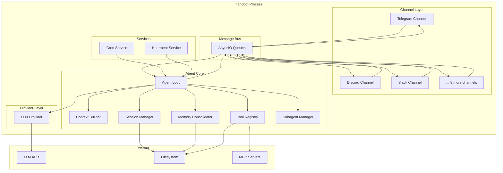

# Container View

## Runtime Architecture

**[FACT]** nanobot runs as a single Python process with two deployment modes:

1. **Gateway Mode** - Long-running server with channels
2. **CLI Mode** - Direct interactive or one-shot execution

## Container Diagram



## Process Model

**[FACT]** Single-process architecture:
- Main thread runs asyncio event loop
- All I/O is async (channels, LLM calls, file ops)
- No multiprocessing or threading
- Concurrent message handling via asyncio tasks

**[INFERENCE]** Implications:
- Vertical scaling only (CPU/memory on single machine)
- Blocking operations block entire process
- Simple deployment (no orchestration needed)
- State in memory + filesystem

## Gateway Mode

**[FACT]** From `cli/commands.py:gateway()`:

### Components
1. **MessageBus** - Async queues for inbound/outbound messages
2. **ChannelManager** - Starts enabled channels
3. **AgentLoop** - Processes messages from bus
4. **SessionManager** - Loads/saves conversation history
5. **CronService** - Scheduled task execution
6. **HeartbeatService** - Proactive agent behavior

### Lifecycle
```python
# Startup sequence
1. Load config
2. Create MessageBus
3. Create LLM Provider
4. Create SessionManager
5. Create CronService
6. Create AgentLoop (with cron)
7. Create ChannelManager
8. Create HeartbeatService
9. Start cron service
10. Start heartbeat service
11. Run agent loop + channels concurrently
```

**[FACT]** Shutdown:
- Ctrl+C triggers KeyboardInterrupt
- Close MCP connections
- Stop heartbeat
- Stop cron
- Stop agent loop
- Stop all channels

## CLI Mode

**[FACT]** From `cli/commands.py:agent()`:

### Two Submodes

**1. One-shot** (`-m "message"`)
- Create agent components
- Process single message directly
- Return response
- Exit

**2. Interactive**
- Create agent + bus
- Start agent loop task
- Read user input (prompt_toolkit)
- Publish to bus
- Consume responses from bus
- Loop until exit command

## WhatsApp Bridge

**[FACT]** Unique architecture from `bridge/`:

**[FACT]** Separate Node.js process:
- TypeScript/Node.js application
- Uses whatsapp-web.js library
- WebSocket server on port 3001
- Communicates with nanobot via WebSocket
- QR code authentication
- Stores auth in separate directory

**[INFERENCE]** Why separate:
- whatsapp-web.js is Node.js only
- Requires browser automation (Puppeteer)
- Heavy dependency (not suitable for Python)

## Data Storage

**[FACT]** File-based persistence:

### Workspace Structure
```
~/.nanobot/
├── config.json              # Main configuration
├── workspace/               # Agent workspace
│   ├── sessions/           # Conversation history (JSONL)
│   ├── memory/             # Memory files (Markdown)
│   │   ├── MEMORY.md       # Long-term facts
│   │   └── HISTORY.md      # Searchable log
│   ├── skills/             # Custom skills
│   │   └── {skill-name}/
│   │       └── SKILL.md
│   ├── AGENTS.md           # Agent identity
│   ├── SOUL.md             # Personality
│   ├── USER.md             # User info
│   └── TOOLS.md            # Tool guidelines
├── cron/
│   └── jobs.json           # Scheduled tasks
├── bridge/                 # WhatsApp bridge (if used)
└── runtime/
    └── whatsapp-auth/      # WhatsApp session
```

## Concurrency Model

**[FACT]** From `agent/loop.py`:

### Message Processing
- Messages consumed from bus with 1s timeout
- Each message spawned as asyncio task
- Tasks tracked per session_key
- Global lock prevents concurrent processing
- `/stop` command cancels session tasks

**[INFERENCE]** Design choice:
- Global lock = sequential processing
- Prevents race conditions in session state
- Simpler than fine-grained locking
- Trade-off: throughput vs. correctness

### Tool Execution
**[FACT]** All tools are async:
- File I/O: async file operations
- Shell: async subprocess
- Web: async HTTP (httpx)
- MCP: async protocol

## MCP Integration

**[FACT]** From `agent/tools/mcp.py`:

**Connection Model**:
- Lazy connection on first message
- AsyncExitStack manages lifecycle
- Supports stdio and HTTP/SSE transports
- Tools registered dynamically
- Reconnect on config change

**[INFERENCE]** Why lazy:
- Avoid startup delay if MCP unused
- Fail gracefully if MCP unavailable
- Retry on next message

## Memory Management

**[FACT]** From `agent/memory.py`:

**Consolidation Strategy**:
- Triggered by token count threshold
- Summarizes old messages to Markdown
- Updates MEMORY.md and HISTORY.md
- Marks messages as consolidated
- Keeps unconsolidated in session

**[INFERENCE]** Purpose:
- Extend effective context window
- Preserve important information
- Reduce token costs
- Enable long conversations

## Deployment Modes

### 1. Local Development
```bash
nanobot agent -m "hello"
```
- Single process
- CLI interaction
- No channels

### 2. Personal Server
```bash
nanobot gateway
```
- Single process
- All enabled channels
- Background service (systemd/supervisor)

### 3. Docker
```yaml
# docker-compose.yml
services:
  nanobot:
    build: .
    volumes:
      - ./workspace:/root/.nanobot/workspace
    environment:
      - NANOBOT_PROVIDERS__OPENAI__API_KEY=...
```
- Containerized single process
- Volume for persistence
- Environment-based config

**[INFERENCE]** Not supported:
- Multi-instance deployment
- Load balancing
- High availability
- Distributed architecture
