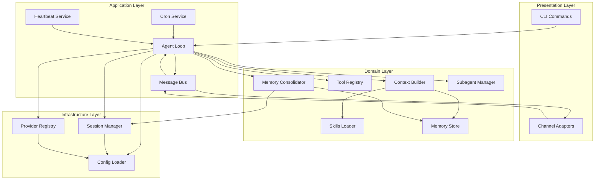

# Component View

## Core Subsystems

**[FACT]** From directory structure analysis, nanobot consists of 8 major subsystems:

```
nanobot/
├── channels/      # Chat platform adapters
├── bus/           # Message routing
├── agent/         # Core agent logic
├── providers/     # LLM abstraction
├── session/       # Conversation state
├── config/        # Configuration system
├── cron/          # Scheduled tasks
├── heartbeat/     # Proactive behavior
├── cli/           # Command-line interface
└── utils/         # Shared utilities
```

## Component Diagram



## 1. Channels Subsystem

**[FACT]** Location: `nanobot/channels/`

### Responsibility
Adapt external chat platforms to internal message bus.

### Key Components
- `base.py` - Abstract channel interface
- `manager.py` - Channel lifecycle management
- `registry.py` - Dynamic channel discovery
- Platform implementations (11 files)

### Key Interfaces
```python
class BaseChannel(ABC):
    async def start() -> None
    async def stop() -> None
    async def send(msg: OutboundMessage) -> None
    def is_allowed(sender_id: str) -> bool
```

### Dependencies
- **Inbound**: Platform SDKs (telegram, discord, slack, etc.)
- **Outbound**: MessageBus

**[INFERENCE]** Design pattern: Adapter pattern for platform abstraction.

## 2. Message Bus Subsystem

**[FACT]** Location: `nanobot/bus/`

### Responsibility
Decouple channels from agent core via async queues.

### Key Components
- `queue.py` - AsyncIO queue wrapper
- `events.py` - Message data structures

### Key Interfaces
```python
class MessageBus:
    async def publish_inbound(msg: InboundMessage)
    async def consume_inbound() -> InboundMessage
    async def publish_outbound(msg: OutboundMessage)
    async def consume_outbound() -> OutboundMessage
```

**[INFERENCE]** Design pattern: Publish-Subscribe with async queues.

## 3. Agent Subsystem

**[FACT]** Location: `nanobot/agent/`

### Responsibility
Core agent logic: LLM interaction, tool execution, context building.

### Key Components
- `loop.py` - Main agent loop (21KB, most complex file)
- `context.py` - System prompt + message building
- `memory.py` - Memory consolidation logic
- `skills.py` - Skills loading and management
- `subagent.py` - Parallel task execution
- `tools/` - Tool implementations (9 files)

### Key Interfaces
```python
class AgentLoop:
    async def run() -> None
    async def process_direct(content: str) -> str
    async def _process_message(msg: InboundMessage) -> OutboundMessage
```

### Dependencies
- **Inbound**: MessageBus, SessionManager, LLMProvider
- **Outbound**: ToolRegistry, ContextBuilder, MemoryConsolidator

**[INFERENCE]** This is the "brain" - most complex subsystem.

## 4. Tools Subsystem

**[FACT]** Location: `nanobot/agent/tools/`

### Responsibility
Provide executable capabilities to the agent.

### Key Components
- `base.py` - Abstract tool interface
- `registry.py` - Tool registration and execution
- `filesystem.py` - File operations (read, write, edit, list)
- `shell.py` - Command execution
- `web.py` - Search and fetch
- `message.py` - Send to channels
- `spawn.py` - Subagent spawning
- `cron.py` - Schedule tasks
- `mcp.py` - MCP server integration

### Key Interfaces
```python
class Tool(ABC):
    @property
    def name() -> str
    @property
    def description() -> str
    @property
    def parameters() -> dict
    async def execute(**kwargs) -> str
```

**[INFERENCE]** Design pattern: Command pattern with JSON Schema validation.

## 5. Providers Subsystem

**[FACT]** Location: `nanobot/providers/`

### Responsibility
Abstract LLM provider differences into unified interface.

### Key Components
- `base.py` - Abstract provider interface
- `registry.py` - Provider discovery and matching
- `litellm_provider.py` - LiteLLM wrapper (most providers)
- `custom_provider.py` - Direct OpenAI-compatible
- `azure_openai_provider.py` - Azure-specific
- `openai_codex_provider.py` - OAuth provider
- `transcription.py` - Audio transcription

### Key Interfaces
```python
class LLMProvider(ABC):
    async def chat(messages, tools, model) -> LLMResponse
    async def chat_with_retry(...) -> LLMResponse
    def get_default_model() -> str
```

**[INFERENCE]** Design pattern: Strategy pattern for provider selection.

## 6. Session Subsystem

**[FACT]** Location: `nanobot/session/`

### Responsibility
Persist and retrieve conversation history.

### Key Components
- `manager.py` - Session CRUD operations

### Key Interfaces
```python
class SessionManager:
    def get_or_create(key: str) -> Session
    def save(session: Session) -> None
    def list_sessions() -> list[dict]

class Session:
    def add_message(role, content, **kwargs)
    def get_history(max_messages) -> list[dict]
    def clear()
```

### Storage Format
**[FACT]** JSONL (JSON Lines):
- One JSON object per line
- First line: metadata
- Subsequent lines: messages
- Append-only for efficiency

**[INFERENCE]** Design choice: Simple, grep-able, no database needed.

## 7. Config Subsystem

**[FACT]** Location: `nanobot/config/`

### Responsibility
Load, validate, and provide configuration.

### Key Components
- `schema.py` - Pydantic models (450 lines)
- `loader.py` - File loading and env vars
- `paths.py` - Path resolution

### Configuration Hierarchy
```
1. Default values (in schema)
2. Config file (~/.nanobot/config.json)
3. Environment variables (NANOBOT_*)
```

**[FACT]** Supports nested env vars: `NANOBOT_PROVIDERS__OPENAI__API_KEY`

## 8. Services Subsystem

**[FACT]** Locations: `nanobot/cron/`, `nanobot/heartbeat/`

### Cron Service
**Responsibility**: Execute scheduled tasks.

**Key Features**:
- Cron expression parsing
- Job persistence (JSON)
- Callback to agent loop
- Optional message delivery

### Heartbeat Service
**Responsibility**: Proactive agent behavior.

**Key Features**:
- Periodic execution (default: 30 min)
- Two-phase: plan → execute
- Delivers to most recent session
- Can be disabled

**[INFERENCE]** Design pattern: Observer pattern with scheduled triggers.

## Component Dependencies

### Dependency Graph
```
CLI → AgentLoop
Channels → MessageBus → AgentLoop
AgentLoop → {ContextBuilder, ToolRegistry, SessionManager, Provider, MemoryConsolidator}
ContextBuilder → {SkillsLoader, MemoryStore}
MemoryConsolidator → {SessionManager, MemoryStore, Provider}
ToolRegistry → {Individual Tools}
Tools → {Filesystem, MCP, SubagentManager}
All → Config
```

**[FACT]** Dependency direction: Inward (infrastructure → domain → application).

**[INFERENCE]** Follows clean architecture principles loosely.

## Module Coupling

**[FACT]** From import analysis:

**Low Coupling**:
- Channels ↔ Agent (via MessageBus only)
- Tools ↔ Agent (via ToolRegistry interface)
- Providers ↔ Agent (via LLMProvider interface)

**High Coupling**:
- AgentLoop ↔ ContextBuilder (direct instantiation)
- AgentLoop ↔ SessionManager (direct instantiation)
- MemoryConsolidator ↔ Multiple components

**[INFERENCE]** AgentLoop is the integration point - high fan-out.

## File Size Analysis

**[FACT]** Largest files (complexity indicators):
1. `agent/loop.py` - 495 lines (core logic)
2. `config/schema.py` - 450 lines (configuration)
3. `channels/feishu.py` - 394 lines (complex channel)
4. `channels/mochat.py` - 362 lines (complex channel)
5. `channels/telegram.py` - 305 lines (feature-rich channel)

**[INFERENCE]** Complexity concentrated in:
- Agent loop (orchestration)
- Configuration (many options)
- Feature-rich channels (Feishu, Mochat, Telegram)
