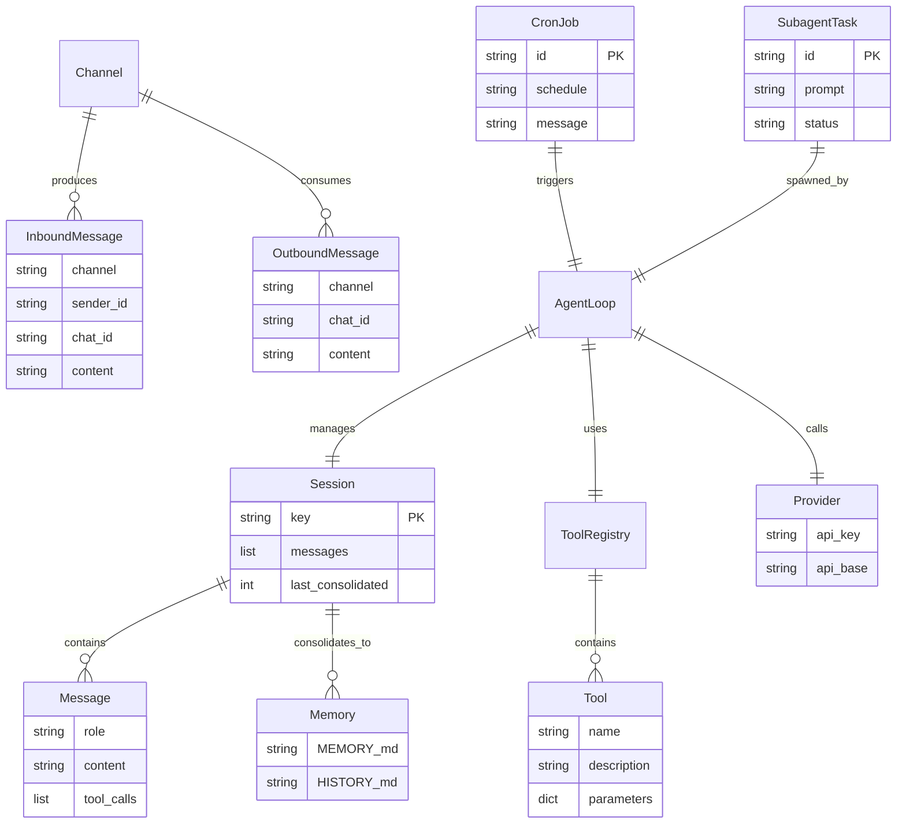

# Domain Model

## Core Entities

### 1. Session

**[FACT]** From `session/manager.py`:

```python
@dataclass
class Session:
    key: str                    # "channel:chat_id"
    messages: list[dict]        # Conversation history
    created_at: datetime
    updated_at: datetime
    metadata: dict
    last_consolidated: int      # Index of last consolidated message
```

**Lifecycle**:
1. Created on first message from channel:chat_id
2. Messages appended on each turn
3. Periodically consolidated to memory files
4. Persisted to JSONL on save
5. Cleared on `/new` command

**Key Constraints**:
- Append-only messages (for LLM cache efficiency)
- Identified by channel:chat_id pair
- One session per chat context

### 2. Message

**[FACT]** From `bus/events.py`:

**InboundMessage** (from user):
```python
channel: str        # Platform identifier
sender_id: str      # User ID
chat_id: str        # Chat/channel ID
content: str        # Message text
media: list[str]    # Media URLs/paths
metadata: dict      # Channel-specific data
session_key: str    # Computed: channel:chat_id
```

**OutboundMessage** (to user):
```python
channel: str
chat_id: str
content: str
reply_to: str | None
media: list[str]
metadata: dict
```

**LLM Message** (internal):
```python
role: str           # "system" | "user" | "assistant" | "tool"
content: str | list | None
tool_calls: list    # For assistant role
tool_call_id: str   # For tool role
name: str           # Tool name for tool role
```

### 3. Tool

**[FACT]** From `agent/tools/base.py`:

```python
class Tool(ABC):
    name: str
    description: str
    parameters: dict    # JSON Schema

    async def execute(**kwargs) -> str
```

**Built-in Tools**:
- read_file, write_file, edit_file, list_dir
- exec (shell command)
- web_search, web_fetch
- message (send to channel)
- spawn (subagent)
- cron (schedule task)

**Lifecycle**:
1. Registered in ToolRegistry
2. Exposed to LLM as function definitions
3. LLM requests tool call
4. Parameters validated against schema
5. Tool executed
6. Result returned as string

### 4. Provider

**[FACT]** From `providers/base.py`:

```python
class LLMProvider(ABC):
    api_key: str | None
    api_base: str | None
    generation: GenerationSettings

    async def chat(messages, tools, model) -> LLMResponse
```

**Provider Types**:
- Gateway (OpenRouter, AiHubMix)
- Direct (Anthropic, OpenAI, DeepSeek)
- OAuth (OpenAI Codex, GitHub Copilot)
- Local (Ollama, vLLM)
- Custom (any OpenAI-compatible)

**Selection Logic**:
1. Check forced provider in config
2. Match by model prefix (e.g., "anthropic/")
3. Match by keyword in model name
4. Fallback to first configured provider

### 5. Skill

**[FACT]** From `agent/skills.py`:

```python
# Skill structure (filesystem-based)
workspace/skills/{skill-name}/
    SKILL.md        # Skill content
    metadata.json   # Optional metadata
```

**Skill Types**:
- **Always-loaded**: Injected into every system prompt
- **On-demand**: Loaded when agent reads SKILL.md

**Metadata**:
```json
{
    "name": "skill-name",
    "description": "What this skill does",
    "available": true,
    "dependencies": ["apt-package"]
}
```

### 6. Memory

**[FACT]** From `agent/memory.py`:

**Memory Files**:
- `MEMORY.md` - Long-term facts (key-value style)
- `HISTORY.md` - Chronological log (grep-searchable)

**Consolidation Process**:
1. Triggered when session exceeds token threshold
2. LLM summarizes unconsolidated messages
3. Extracts facts → MEMORY.md
4. Logs events → HISTORY.md
5. Marks messages as consolidated
6. Session keeps all messages (for cache)

### 7. CronJob

**[FACT]** From `cron/types.py`:

```python
@dataclass
class CronJob:
    id: str
    name: str
    schedule: str       # Cron expression
    payload: JobPayload
    enabled: bool
    created_at: datetime
```

**JobPayload**:
```python
message: str        # Instruction for agent
channel: str | None # Target channel
to: str | None      # Target chat_id
deliver: bool       # Whether to send response
```

**Lifecycle**:
1. Created via cron tool
2. Persisted to jobs.json
3. Scheduler checks every second
4. On trigger: execute via agent loop
5. Optional delivery to channel

### 8. Subagent

**[FACT]** From `agent/subagent.py`:

```python
@dataclass
class SubagentTask:
    id: str
    session_key: str
    prompt: str
    status: str         # "running" | "completed" | "failed"
    result: str | None
    task: asyncio.Task
```

**Purpose**: Parallel task execution without blocking main agent.

**Lifecycle**:
1. Spawned via spawn tool
2. Runs in separate asyncio task
3. Has own message history
4. Returns result to parent
5. Can be cancelled via /stop

## Entity Relationships



## Key Concepts

### Session Key
**[FACT]** Format: `{channel}:{chat_id}`

Examples:
- `telegram:123456789`
- `discord:987654321`
- `cli:direct`
- `cron:job-id-123`

**Purpose**: Isolate conversations per chat context.

### Context Window Management
**[FACT]** Strategy:
1. System prompt (identity + memory + skills)
2. Unconsolidated history (last N messages)
3. Current user message
4. Total must fit in context_window_tokens

**Consolidation Trigger**:
```python
if estimated_tokens > context_window_tokens * 0.8:
    consolidate_to_memory()
```

### Tool Call Loop
**[FACT]** From `agent/loop.py`:

```
while iteration < max_iterations:
    response = llm.chat(messages, tools)
    if response.has_tool_calls:
        for tool_call in response.tool_calls:
            result = execute_tool(tool_call)
            messages.append(tool_result)
    else:
        return response.content
```

**Max iterations**: 40 (configurable)

### Allowlist Authorization
**[FACT]** Per-channel configuration:

```json
{
  "channels": {
    "telegram": {
      "allowFrom": ["user123", "user456"]
    }
  }
}
```

**Special values**:
- Empty list `[]` → deny all
- Wildcard `["*"]` → allow all

## State Transitions

### Session State
```
[Not Exists] --first message--> [Active]
[Active] --/new command--> [Cleared]
[Active] --consolidation--> [Active + Memory Updated]
```

### Message Processing State
```
[Received] --> [Validated] --> [Queued] --> [Processing] --> [Responded]
                    ↓
                [Rejected] (not in allowlist)
```

### Tool Execution State
```
[Requested] --> [Validated] --> [Executing] --> [Completed]
                    ↓                ↓
                [Invalid]        [Failed]
```

### Cron Job State
```
[Created] --> [Scheduled] --> [Triggered] --> [Executing] --> [Completed]
                  ↓                              ↓
              [Disabled]                     [Failed]
```
