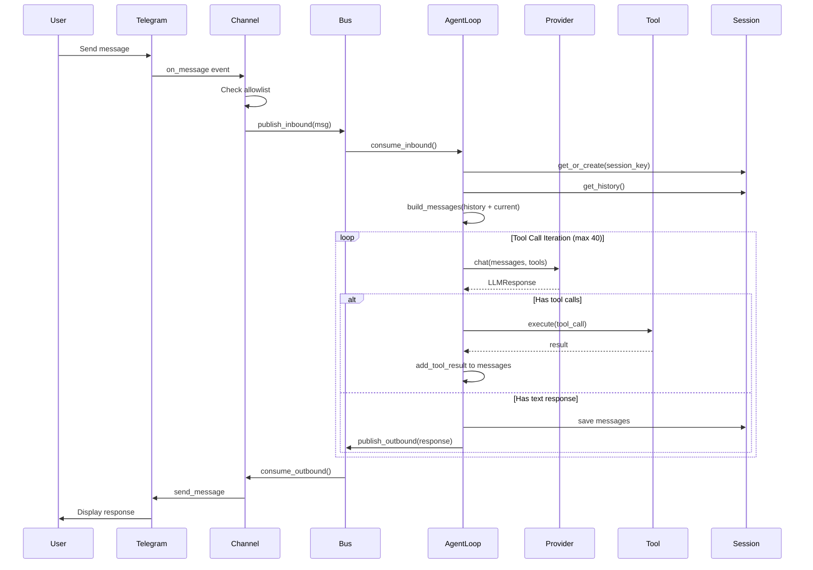
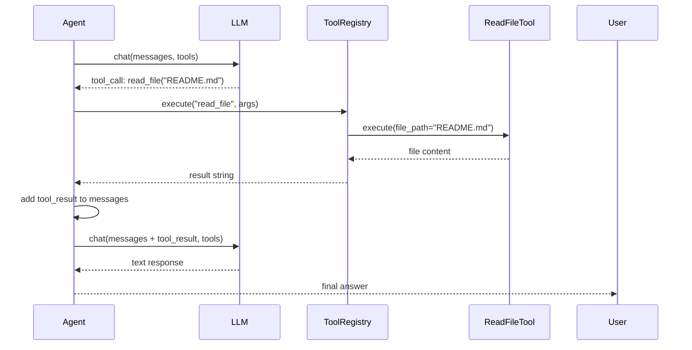
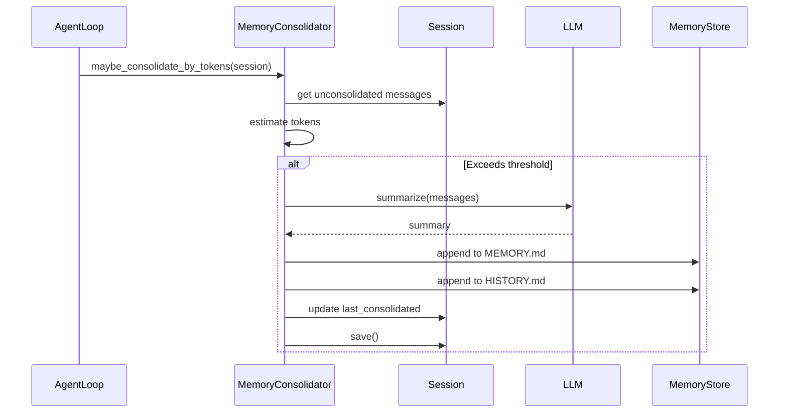
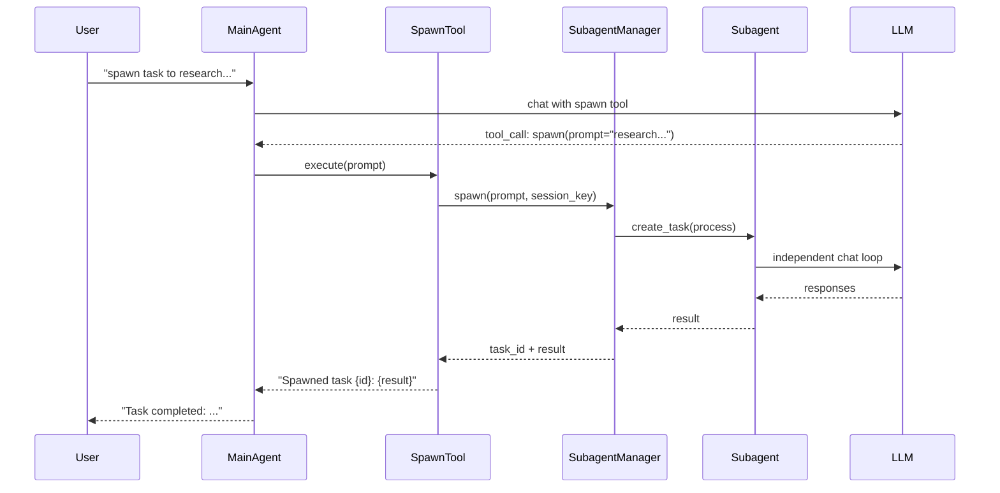
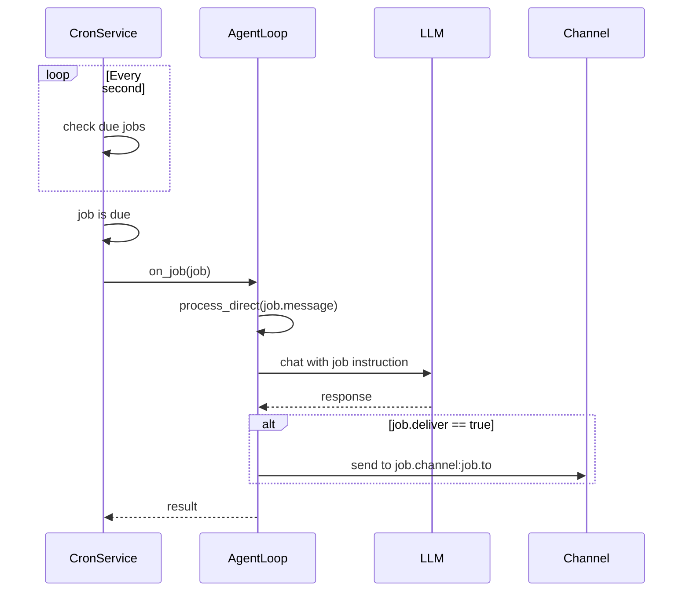
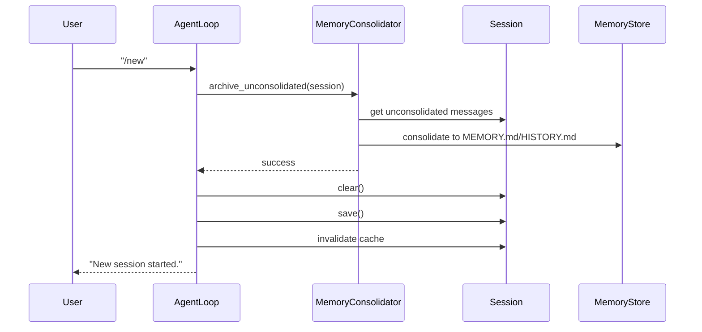

# Runtime Scenarios

## Scenario 1: User Message Processing

**[FACT]** 完整的消息处理流程，从 `channels/telegram.py` 和 `agent/loop.py` 分析：

### Sequence Diagram



### 关键步骤

**[FACT]** 从代码追踪：

1. **接收阶段** (`channels/telegram.py:_handle_message`)
   - 平台 SDK 触发事件
   - 提取 sender_id, chat_id, content
   - 检查 allowlist
   - 创建 InboundMessage

2. **路由阶段** (`bus/queue.py`)
   - 消息放入 inbound 队列
   - AgentLoop 消费消息
   - 创建 asyncio.Task 处理

3. **上下文构建** (`agent/context.py`)
   - 加载 session history
   - 构建 system prompt (identity + memory + skills)
   - 添加 runtime context (时间、channel)
   - 合并为完整 messages 列表

4. **LLM 调用** (`agent/loop.py:_run_agent_loop`)
   - 调用 provider.chat_with_retry()
   - 获取响应（文本或工具调用）
   - 如有工具调用，执行并循环

5. **工具执行** (`agent/tools/registry.py`)
   - 验证参数
   - 执行工具
   - 返回字符串结果

6. **保存状态** (`session/manager.py`)
   - 追加消息到 session
   - 保存到 JSONL 文件
   - 检查是否需要 consolidation

7. **响应发送** (`channels/telegram.py:send`)
   - 从 outbound 队列消费
   - 调用平台 API 发送
   - 处理错误和重试

## Scenario 2: Tool Call Chain

**[FACT]** 工具调用链示例，从 `agent/loop.py` 分析：

### Example Flow

```
User: "Read the README and summarize it"

Iteration 1:
  LLM → tool_call: read_file("README.md")
  Tool → result: "# nanobot\n\nA lightweight..."

Iteration 2:
  LLM → text: "The README describes nanobot as..."
  → Return to user
```

### Sequence Diagram



### 关键机制

**[FACT]** 从 `agent/loop.py:_run_agent_loop`:

- **迭代限制**: 最多 40 次（防止无限循环）
- **工具结果截断**: 超过 16,000 字符会被截断
- **错误处理**: 工具失败返回错误信息，LLM 可以重试
- **进度流式**: 可选的工具调用提示发送到用户

## Scenario 3: Memory Consolidation

**[FACT]** 内存整合流程，从 `agent/memory.py` 分析：

### Trigger Condition

```python
estimated_tokens = len(messages) * 100  # 粗略估算
if estimated_tokens > context_window_tokens * 0.8:
    consolidate()
```

### Consolidation Process



### 输出格式

**[FACT]** 从 `agent/memory.py`:

**MEMORY.md** (事实提取):
```markdown
- User prefers Python over JavaScript
- Working on nanobot documentation project
- Uses macOS with Python 3.11
```

**HISTORY.md** (时间线):
```markdown
[2026-03-12 08:30] User asked about nanobot architecture
[2026-03-12 08:35] Created system design documentation
```

## Scenario 4: Subagent Spawning

**[FACT]** 子代理生成流程，从 `agent/subagent.py` 分析：

### Use Case

```
User: "Spawn a task to research Python async patterns"
```

### Sequence Diagram



### 关键特性

**[FACT]**:
- 独立的消息历史
- 并行执行（asyncio.Task）
- 可通过 /stop 取消
- 结果返回给父代理

## Scenario 5: Cron Job Execution

**[FACT]** 定时任务执行，从 `cron/service.py` 和 `agent/loop.py` 分析：

### Creation

```
User: "Schedule a daily reminder at 9am"
LLM: tool_call: cron(schedule="0 9 * * *", message="Daily reminder")
```

### Execution Flow



### 持久化

**[FACT]** 存储在 `~/.nanobot/cron/jobs.json`:
```json
{
  "jobs": [
    {
      "id": "uuid",
      "name": "daily-reminder",
      "schedule": "0 9 * * *",
      "payload": {
        "message": "Check daily tasks",
        "channel": "telegram",
        "to": "123456",
        "deliver": true
      },
      "enabled": true
    }
  ]
}
```

## Scenario 6: Session Restart (/new)

**[FACT]** 会话重启流程，从 `agent/loop.py:_process_message`:

### Sequence



### 关键点

**[FACT]**:
- 未整合的消息先归档到 memory
- Session 清空但保留 key
- 缓存失效，下次重新加载
- 失败时不清空（保护数据）
