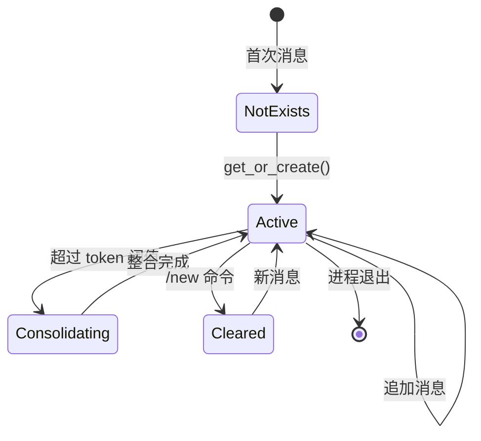
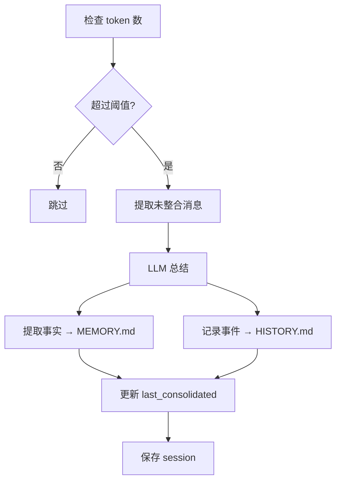

# State and Session Model

## Session 生命周期

**[FACT]** 从 `session/manager.py` 分析：

### 状态机



### 关键状态

**[FACT]** Session 数据结构：

```python
@dataclass
class Session:
    key: str                    # "channel:chat_id"
    messages: list[dict]        # 只追加，不删除
    created_at: datetime
    updated_at: datetime
    metadata: dict
    last_consolidated: int      # 已整合的消息索引
```

## Session 标识

**[FACT]** Session Key 格式：

### 标准格式
```
{channel}:{chat_id}
```

### 实例
- `telegram:123456789` - Telegram 私聊
- `discord:987654321` - Discord DM
- `slack:C01ABC123` - Slack 频道
- `cli:direct` - CLI 直接模式
- `cron:job-uuid` - Cron 任务
- `heartbeat` - Heartbeat 服务

**[INFERENCE]** 设计意图：
- 每个聊天上下文独立会话
- 跨平台不共享（同一用户在不同平台 = 不同会话）
- 特殊会话用于系统功能

## 消息追加模型

**[FACT]** 从 `agent/loop.py:_save_turn`:

### 追加规则

```python
# 只追加新消息，不修改历史
for m in messages[skip:]:
    # 过滤空 assistant 消息
    if role == "assistant" and not content and not tool_calls:
        continue

    # 截断过大的 tool 结果
    if role == "tool" and len(content) > 16000:
        content = content[:16000] + "\n... (truncated)"

    session.messages.append(entry)
```

### 为什么只追加？

**[INFERENCE]** 设计原因：
1. **LLM 缓存效率** - 不修改历史可利用 KV cache
2. **简单性** - 无需复杂的更新逻辑
3. **审计** - 完整保留对话历史
4. **恢复** - 可回溯任意时间点

## 上下文窗口管理

**[FACT]** 从 `session/manager.py:get_history`:

### 获取策略

```python
def get_history(max_messages: int = 500) -> list[dict]:
    # 1. 只返回未整合的消息
    unconsolidated = messages[last_consolidated:]

    # 2. 取最后 N 条
    sliced = unconsolidated[-max_messages:]

    # 3. 对齐到 user 消息（避免孤立的 tool_result）
    for i, m in enumerate(sliced):
        if m["role"] == "user":
            return sliced[i:]
```

### Token 估算

**[FACT]** 从 `agent/memory.py`:

```python
# 粗略估算：每条消息 ~100 tokens
estimated = len(messages) * 100

# 触发整合阈值：80% 上下文窗口
if estimated > context_window_tokens * 0.8:
    consolidate()
```

**[OPEN QUESTION]** 是否应该使用 tiktoken 精确计算？

## Memory 整合机制

**[FACT]** 从 `agent/memory.py:MemoryConsolidator`:

### 整合时机

1. **Token 阈值触发** - 每次消息处理前检查
2. **手动触发** - `/new` 命令时强制整合

### 整合过程



### 输出格式

**[FACT]** MEMORY.md 结构：
```markdown
# Memory

## User Profile
- Name: [if mentioned]
- Preferences: ...

## Project Context
- Working on: nanobot documentation
- Tech stack: Python 3.11, asyncio

## Important Facts
- User prefers detailed technical analysis
- Timezone: UTC+8
```

**[FACT]** HISTORY.md 结构：
```markdown
# History

[2026-03-12 08:30] User asked about system architecture
[2026-03-12 08:35] Created 5 documentation files
[2026-03-12 08:40] Discussed memory consolidation
```

## Session 持久化

**[FACT]** 从 `session/manager.py:save`:

### JSONL 格式

```jsonl
{"_type":"metadata","key":"telegram:123","created_at":"2026-03-12T08:00:00","last_consolidated":10}
{"role":"user","content":"Hello","timestamp":"2026-03-12T08:00:01"}
{"role":"assistant","content":"Hi!","timestamp":"2026-03-12T08:00:02"}
{"role":"user","content":"How are you?","timestamp":"2026-03-12T08:00:05"}
```

### 优势

**[INFERENCE]**:
- 易于追加（不需要重写整个文件）
- 可用 grep 搜索
- 人类可读
- 无需数据库

### 文件位置

**[FACT]**:
```
~/.nanobot/workspace/sessions/
├── telegram_123456.jsonl
├── discord_987654.jsonl
└── cli_direct.jsonl
```

## 缓存策略

**[FACT]** 从 `session/manager.py`:

### 内存缓存

```python
class SessionManager:
    _cache: dict[str, Session] = {}

    def get_or_create(key: str) -> Session:
        if key in _cache:
            return _cache[key]
        session = _load(key) or Session(key=key)
        _cache[key] = session
        return session
```

### 缓存失效

**[FACT]** 触发时机：
- `/new` 命令后调用 `invalidate(key)`
- 进程重启（内存清空）

**[INFERENCE]** 无 TTL 或 LRU - 假设会话数量有限。

## 并发控制

**[FACT]** 从 `agent/loop.py`:

### 全局锁

```python
_processing_lock = asyncio.Lock()

async def _dispatch(msg: InboundMessage):
    async with self._processing_lock:
        response = await self._process_message(msg)
```

**[INFERENCE]** 设计权衡：
- ✅ 避免 session 竞态条件
- ✅ 简单实现
- ❌ 牺牲并发吞吐量
- ❌ 一个慢请求阻塞所有请求

### 任务跟踪

**[FACT]**:
```python
_active_tasks: dict[str, list[asyncio.Task]] = {}

# 按 session_key 跟踪任务
task = asyncio.create_task(self._dispatch(msg))
self._active_tasks[msg.session_key].append(task)
```

**用途**: `/stop` 命令可取消特定会话的任务。

## 状态恢复

**[FACT]** 进程重启后：

1. **Session 恢复** - 从 JSONL 文件加载
2. **Memory 恢复** - 从 MEMORY.md/HISTORY.md 读取
3. **Cron 恢复** - 从 jobs.json 加载
4. **MCP 重连** - 重新建立连接

**[OPEN QUESTION]** 是否需要 WAL 或 checkpoint 机制？
