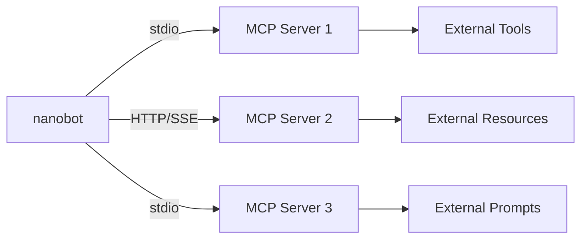
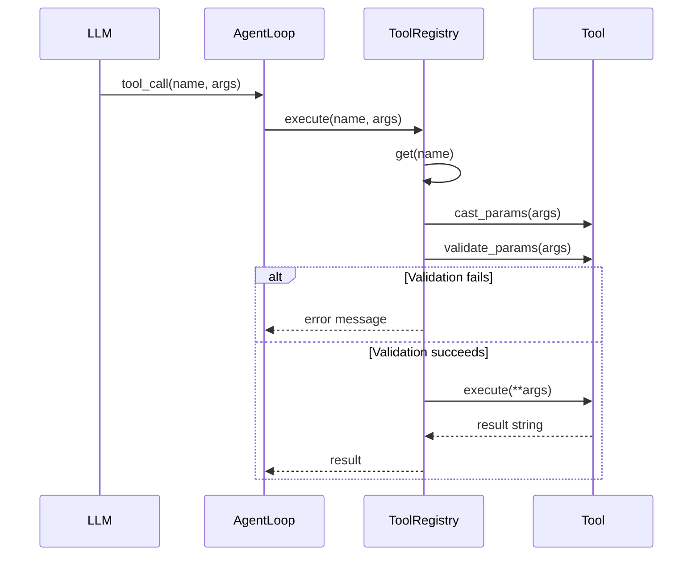

# Tool and Extension Model

## 工具系统架构

**[FACT]** 从 `agent/tools/` 分析：

### 核心抽象

```python
class Tool(ABC):
    @property
    def name() -> str
    @property
    def description() -> str
    @property
    def parameters() -> dict  # JSON Schema

    async def execute(**kwargs) -> str
```

### 工具注册表

**[FACT]** 从 `agent/tools/registry.py`:

```python
class ToolRegistry:
    _tools: dict[str, Tool] = {}

    def register(tool: Tool)
    def get(name: str) -> Tool | None
    def get_definitions() -> list[dict]  # OpenAI 格式
    async def execute(name: str, args: dict) -> str
```

## 内置工具

**[FACT]** 9 个核心工具：

### 1. 文件系统工具

**read_file** (`filesystem.py`):
```python
parameters:
  file_path: string (required)
  offset: integer (optional)
  limit: integer (optional)
```

**write_file** (`filesystem.py`):
```python
parameters:
  file_path: string (required)
  content: string (required)
```

**edit_file** (`filesystem.py`):
```python
parameters:
  file_path: string (required)
  old_text: string (required)
  new_text: string (required)
```

**list_dir** (`filesystem.py`):
```python
parameters:
  path: string (optional, default: workspace)
```

**[FACT]** 可选的 workspace 限制：
```python
if restrict_to_workspace:
    # 只允许访问 workspace 目录内的文件
    if not path.is_relative_to(workspace):
        raise PermissionError
```

### 2. Shell 工具

**exec** (`shell.py`):
```python
parameters:
  command: string (required)
  timeout: integer (optional, default: 60)
```

**[FACT]** 安全特性：
- 超时保护
- 可选的 workspace 限制
- PATH 追加支持
- 异步执行（asyncio.subprocess）

### 3. Web 工具

**web_search** (`web.py`):
```python
parameters:
  query: string (required)
  max_results: integer (optional, default: 5)

# 需要 Brave Search API key
```

**web_fetch** (`web.py`):
```python
parameters:
  url: string (required)

# 使用 readability-lxml 提取正文
```

### 4. 消息工具

**message** (`message.py`):
```python
parameters:
  to: string (required)  # channel:chat_id
  content: string (required)

# 发送消息到指定频道
```

### 5. 子代理工具

**spawn** (`spawn.py`):
```python
parameters:
  prompt: string (required)

# 生成独立的子代理任务
```

### 6. Cron 工具

**cron** (`cron.py`):
```python
parameters:
  action: string (required)  # "create" | "list" | "delete"
  schedule: string (for create)
  name: string (for create/delete)
  message: string (for create)
  deliver: boolean (optional)
  to: string (optional)
```

## MCP 集成

**[FACT]** 从 `agent/tools/mcp.py` 分析：

### 连接模型



### 配置格式

**[FACT]** 从 `config/schema.py`:

```json
{
  "tools": {
    "mcpServers": {
      "filesystem": {
        "type": "stdio",
        "command": "npx",
        "args": ["-y", "@modelcontextprotocol/server-filesystem", "/path"],
        "env": {"KEY": "value"}
      },
      "github": {
        "type": "sse",
        "url": "http://localhost:3000/sse",
        "headers": {"Authorization": "Bearer token"}
      }
    }
  }
}
```

### 动态工具注册

**[FACT]** MCP 工具在运行时注册：

```python
async def connect_mcp_servers(servers, registry, stack):
    for name, config in servers.items():
        client = await create_client(config)
        tools = await client.list_tools()

        for tool in tools:
            # 包装为 nanobot Tool
            wrapped = MCPToolWrapper(client, tool)
            registry.register(wrapped)
```

## Skills 系统

**[FACT]** 从 `agent/skills.py` 分析：

### 文件结构

```
workspace/skills/
├── memory/
│   └── SKILL.md
├── github/
│   ├── SKILL.md
│   └── metadata.json
└── custom-skill/
    └── SKILL.md
```

### Metadata 格式

```json
{
  "name": "github",
  "description": "GitHub operations",
  "available": true,
  "dependencies": ["gh"],
  "always_load": false
}
```

### 加载机制

**[FACT]** 两种加载方式：

1. **Always-load** - 注入到每个 system prompt
2. **On-demand** - Agent 使用 read_file 工具读取

**[INFERENCE]** 设计意图：
- Always-load 用于核心能力
- On-demand 避免 prompt 过大

### Skills 发现

**[FACT]** 从 `agent/skills.py:build_skills_summary`:

```python
def build_skills_summary() -> str:
    skills = []
    for skill_dir in workspace.glob("skills/*/"):
        meta = load_metadata(skill_dir)
        skills.append({
            "name": meta["name"],
            "description": meta["description"],
            "available": meta["available"],
            "path": f"skills/{meta['name']}/SKILL.md"
        })
    return format_as_table(skills)
```

## 扩展点

**[FACT]** 4 个主要扩展机制：

### 1. 自定义工具

```python
class CustomTool(Tool):
    @property
    def name(self) -> str:
        return "my_tool"

    @property
    def description(self) -> str:
        return "Does something"

    @property
    def parameters(self) -> dict:
        return {
            "type": "object",
            "properties": {
                "arg": {"type": "string"}
            },
            "required": ["arg"]
        }

    async def execute(self, arg: str) -> str:
        return f"Result: {arg}"

# 注册
registry.register(CustomTool())
```

### 2. MCP Servers

**[INFERENCE]** 适用场景：
- 需要外部服务集成
- 跨语言工具（非 Python）
- 标准化工具接口

### 3. Skills

**[INFERENCE]** 适用场景：
- 领域知识注入
- 工作流指导
- 最佳实践文档

### 4. Provider Plugins

**[FACT]** 从 `providers/registry.py`:

```python
@dataclass
class ProviderSpec:
    name: str
    label: str
    keywords: list[str]
    is_oauth: bool = False
    is_local: bool = False
    is_gateway: bool = False
    default_api_base: str | None = None

# 添加新 provider
PROVIDERS.append(ProviderSpec(
    name="my_provider",
    label="My Provider",
    keywords=["myprovider"],
))
```

## 参数验证

**[FACT]** 从 `agent/tools/base.py`:

### JSON Schema 验证

```python
def validate_params(params: dict) -> list[str]:
    errors = []

    # 类型检查
    if not isinstance(params["arg"], str):
        errors.append("arg must be string")

    # 必填检查
    if "required_field" not in params:
        errors.append("missing required_field")

    # 范围检查
    if params.get("count", 0) > 100:
        errors.append("count must be <= 100")

    return errors
```

### 类型转换

**[FACT]** 自动类型转换：

```python
# LLM 可能返回字符串 "123"
# 自动转换为 int 123
def cast_params(params: dict) -> dict:
    if schema["type"] == "integer":
        return int(params["value"])
```

## 工具执行流程


