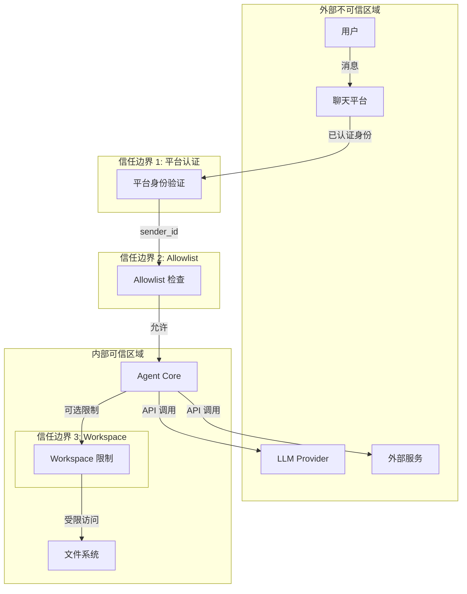

# Security and Trust Boundaries

## 信任边界

**[FACT]** 从代码分析，nanobot 有 3 个主要信任边界：



## 认证与授权

**[FACT]** 从 `channels/base.py`:

### 平台认证

```python
# nanobot 信任平台提供的身份
# 不进行额外的用户认证
```

**[INFERENCE]** 假设：
- 平台已正确认证用户
- sender_id 不可伪造
- 平台 API token 安全存储

### Allowlist 授权

**[FACT]** 每个 channel 独立配置：

```python
def is_allowed(sender_id: str) -> bool:
    allow_list = config.allow_from

    if not allow_list:
        # 空列表 = 拒绝所有
        return False

    if "*" in allow_list:
        # 通配符 = 允许所有
        return True

    return str(sender_id) in allow_list
```

**配置示例**:
```json
{
  "channels": {
    "telegram": {
      "allowFrom": ["123456", "789012"]
    },
    "discord": {
      "allowFrom": ["*"]
    }
  }
}
```

**[INFERENCE]** 安全模型：
- ✅ 简单易懂
- ✅ 适合个人/小团队
- ❌ 无细粒度权限
- ❌ 无审计日志
- ❌ 无速率限制

## 数据隔离

**[FACT]** 从实现分析：

### Session 隔离

```
telegram:user1 → session_1
telegram:user2 → session_2
discord:user1  → session_3
```

**[FACT]** 隔离级别：
- ✅ 不同 channel:chat_id = 不同 session
- ❌ 同一进程内所有 session 共享内存
- ❌ 无用户间数据隔离

### Workspace 共享

**[FACT]** 所有用户共享：
- 同一个 workspace 目录
- 同一套 memory 文件
- 同一套 skills

**[INFERENCE]** 适用场景：
- 个人使用
- 信任的小团队
- 非多租户环境

## 文件系统安全

**[FACT]** 从 `agent/tools/filesystem.py`:

### Workspace 限制

```python
if restrict_to_workspace:
    resolved = Path(file_path).resolve()
    if not resolved.is_relative_to(workspace):
        return "Error: Access denied outside workspace"
```

**配置**:
```json
{
  "tools": {
    "restrictToWorkspace": true
  }
}
```

**[FACT]** 默认值：`false` (不限制)

**[INFERENCE]** 风险：
- 默认配置下，agent 可访问整个文件系统
- 依赖 LLM 的"善意"
- 适合个人使用，不适合多用户

### 路径遍历防护

**[OPEN QUESTION]** 是否有路径遍历检查？

从代码看：
```python
# 使用 Path.resolve() 规范化路径
resolved = Path(file_path).resolve()
```

**[INFERENCE]** 基本防护存在，但未见显式的 `..` 检查。

## Shell 执行安全

**[FACT]** 从 `agent/tools/shell.py`:

### 执行限制

```python
async def execute(command: str, timeout: int = 60):
    # 超时保护
    proc = await asyncio.create_subprocess_shell(
        command,
        stdout=PIPE,
        stderr=PIPE,
    )
    stdout, stderr = await asyncio.wait_for(
        proc.communicate(),
        timeout=timeout
    )
```

**[FACT]** 安全特性：
- ✅ 超时保护（防止无限运行）
- ❌ 无命令白名单
- ❌ 无危险命令检测
- ❌ 无资源限制（CPU/内存）

**[INFERENCE]** 风险：
- Agent 可执行任意 shell 命令
- 可能的破坏性操作（rm -rf）
- 依赖 LLM 判断

### Workspace 限制

**[FACT]** 可选的工作目录限制：

```python
if restrict_to_workspace:
    # 在 workspace 目录下执行
    cwd = workspace
```

## 网络安全

**[FACT]** 从 `agent/tools/web.py`:

### 出站请求

```python
# web_fetch 可访问任意 URL
async def web_fetch(url: str):
    async with httpx.AsyncClient() as client:
        response = await client.get(url)
```

**[INFERENCE]** 风险：
- 可访问内网地址（SSRF）
- 无 URL 白名单
- 无请求大小限制

### 代理支持

**[FACT]** 可配置 HTTP/SOCKS5 代理：

```json
{
  "tools": {
    "web": {
      "proxy": "http://127.0.0.1:7890"
    }
  }
}
```

## 敏感信息保护

**[FACT]** 从配置系统分析：

### API Key 存储

```json
{
  "providers": {
    "openai": {
      "apiKey": "sk-..."
    }
  }
}
```

**[FACT]** 存储位置：
- `~/.nanobot/config.json` (明文)
- 环境变量 `NANOBOT_PROVIDERS__OPENAI__API_KEY`

**[INFERENCE]** 风险：
- 配置文件明文存储
- 无加密
- 依赖文件系统权限

### 日志脱敏

**[OPEN QUESTION]** 是否有日志脱敏？

从代码看：
```python
logger.info("Tool call: {}({})", name, args[:200])
```

**[INFERENCE]** 可能泄露敏感参数到日志。

## MCP 安全

**[FACT]** 从 `agent/tools/mcp.py`:

### Stdio 模式

```python
# 启动外部进程
proc = await asyncio.create_subprocess_exec(
    command,
    *args,
    stdin=PIPE,
    stdout=PIPE,
)
```

**[INFERENCE]** 风险：
- 执行任意命令
- 依赖 MCP server 的安全性
- 无沙箱隔离

### HTTP 模式

```python
# 连接到远程 MCP server
client = await create_http_client(url, headers)
```

**[INFERENCE]** 风险：
- 可连接任意 URL
- 无 TLS 验证配置
- 依赖 server 认证

## 威胁模型

**[INFERENCE]** 基于架构分析：

### 威胁 1: 恶意用户

**场景**: 未授权用户尝试访问

**防护**:
- ✅ Allowlist 检查
- ❌ 无速率限制
- ❌ 无审计日志

### 威胁 2: LLM 越狱

**场景**: LLM 被诱导执行危险操作

**防护**:
- ❌ 无命令白名单
- ❌ 无危险操作检测
- ✅ 可选 workspace 限制

### 威胁 3: 数据泄露

**场景**: Session 数据被其他用户访问

**防护**:
- ✅ Session key 隔离
- ❌ 无加密存储
- ❌ 无访问控制

### 威胁 4: SSRF

**场景**: 通过 web_fetch 访问内网

**防护**:
- ❌ 无 URL 白名单
- ❌ 无内网地址检测

### 威胁 5: 配置泄露

**场景**: API key 被读取

**防护**:
- ❌ 明文存储
- ✅ 文件系统权限
- ❌ 无加密

## 安全建议

**[INFERENCE]** 基于分析的建议：

### 部署建议

1. **启用 workspace 限制**
   ```json
   {"tools": {"restrictToWorkspace": true}}
   ```

2. **最小化 allowlist**
   - 只添加信任的用户
   - 避免使用 `"*"`

3. **文件权限**
   ```bash
   chmod 600 ~/.nanobot/config.json
   ```

4. **网络隔离**
   - 使用防火墙限制出站
   - 考虑代理过滤

5. **审计**
   - 定期检查 session 文件
   - 监控 shell 命令执行

### 不适用场景

**[INFERENCE]** nanobot 不适合：
- 多租户 SaaS
- 处理敏感数据
- 公开访问的服务
- 需要合规认证的环境
