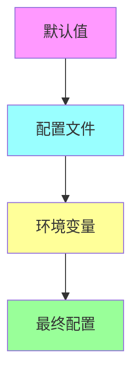

# Configuration and Operability

## 配置系统架构

**[FACT]** 从 `config/` 分析，三层配置体系：



### 优先级

1. **环境变量** (最高优先级)
2. **配置文件** `~/.nanobot/config.json`
3. **默认值** (schema 中定义)

## 配置文件结构

**[FACT]** 从 `config/schema.py`:

```json
{
  "agents": {
    "defaults": {
      "workspace": "~/.nanobot/workspace",
      "model": "anthropic/claude-opus-4-5",
      "provider": "auto",
      "maxTokens": 8192,
      "contextWindowTokens": 65536,
      "temperature": 0.1,
      "maxToolIterations": 40,
      "reasoningEffort": null
    }
  },
  "channels": {
    "sendProgress": true,
    "sendToolHints": false,
    "telegram": {"enabled": false, "token": "", "allowFrom": []},
    "discord": {"enabled": false, "token": "", "allowFrom": []},
    "slack": {"enabled": false, "botToken": "", "allowFrom": []}
  },
  "providers": {
    "anthropic": {"apiKey": "", "apiBase": null},
    "openai": {"apiKey": "", "apiBase": null},
    "openrouter": {"apiKey": "", "apiBase": null}
  },
  "gateway": {
    "host": "0.0.0.0",
    "port": 18790,
    "heartbeat": {"enabled": true, "intervalS": 1800}
  },
  "tools": {
    "web": {"proxy": null, "search": {"apiKey": "", "maxResults": 5}},
    "exec": {"timeout": 60, "pathAppend": ""},
    "restrictToWorkspace": false,
    "mcpServers": {}
  }
}
```

## 环境变量

**[FACT]** 支持嵌套环境变量：

```bash
# 格式: NANOBOT_{SECTION}__{SUBSECTION}__{KEY}
export NANOBOT_PROVIDERS__OPENAI__API_KEY="sk-..."
export NANOBOT_AGENTS__DEFAULTS__MODEL="gpt-4"
export NANOBOT_CHANNELS__TELEGRAM__TOKEN="123:ABC"
```

**[FACT]** 从 `config/schema.py`:
```python
model_config = ConfigDict(
    env_prefix="NANOBOT_",
    env_nested_delimiter="__"
)
```

## 配置加载

**[FACT]** 从 `config/loader.py`:

```python
def load_config(path: Path | None = None) -> Config:
    # 1. 确定配置文件路径
    config_path = path or get_config_path()

    # 2. 读取 JSON
    if config_path.exists():
        data = json.loads(config_path.read_text())
    else:
        data = {}

    # 3. 合并环境变量
    config = Config(**data)

    return config
```

### 配置路径

**[FACT]**:
- 默认: `~/.nanobot/config.json`
- CLI 覆盖: `--config /path/to/config.json`
- 环境变量: `NANOBOT_CONFIG_PATH`

## Provider 匹配

**[FACT]** 从 `config/schema.py:_match_provider`:

### 匹配逻辑

```python
def _match_provider(model: str) -> tuple[ProviderConfig, str]:
    # 1. 强制指定 provider
    if config.agents.defaults.provider != "auto":
        return get_provider(forced_provider)

    # 2. 模型前缀匹配
    # "anthropic/claude-opus" → anthropic
    prefix = model.split("/")[0]
    if provider_has_prefix(prefix):
        return get_provider(prefix)

    # 3. 关键词匹配
    # "gpt-4" → openai
    for spec in PROVIDERS:
        if any(kw in model.lower() for kw in spec.keywords):
            return get_provider(spec.name)

    # 4. 本地 provider fallback
    for spec in LOCAL_PROVIDERS:
        if spec.api_base:
            return get_provider(spec.name)

    # 5. 第一个配置的 provider
    for spec in PROVIDERS:
        if spec.api_key:
            return get_provider(spec.name)
```

## 运行时配置

**[FACT]** 某些配置可在运行时修改：

### Workspace 覆盖

```bash
nanobot agent --workspace /tmp/test-workspace
```

### Model 覆盖

```bash
nanobot agent --model gpt-4
```

**[INFERENCE]** CLI 参数 > 配置文件 > 默认值

## 配置验证

**[FACT]** 使用 Pydantic 验证：

```python
class Config(BaseSettings):
    agents: AgentsConfig
    channels: ChannelsConfig
    providers: ProvidersConfig
    # ...

# 自动验证
config = Config(**data)  # 抛出 ValidationError 如果无效
```

### 常见验证

- 端口范围: 1-65535
- 超时: > 0
- Token 数: > 0
- 必填字段检查

## 日志配置

**[FACT]** 使用 loguru:

```python
from loguru import logger

# CLI 模式
if logs:
    logger.enable("nanobot")
else:
    logger.disable("nanobot")
```

**[INFERENCE]** 无细粒度日志级别配置。

## 监控与调试

**[FACT]** 内置命令：

### 状态检查

```bash
nanobot status
```

输出:
```
Config: ~/.nanobot/config.json ✓
Workspace: ~/.nanobot/workspace ✓
Model: anthropic/claude-opus-4-5
Anthropic: ✓
OpenAI: not set
```

### Channel 状态

```bash
nanobot channels status
```

输出:
```
Channel      Enabled
Telegram     ✓
Discord      ✗
Slack        ✗
```

## 故障排查

**[FACT]** 常见问题：

### 1. API Key 未配置

```
Error: No API key configured.
Set one in ~/.nanobot/config.json
```

**解决**: 添加 provider API key

### 2. Channel 连接失败

```
Error: Failed to connect to Telegram
```

**排查**:
- 检查 token 是否正确
- 检查网络连接
- 检查代理配置

### 3. MCP Server 连接失败

```
Failed to connect MCP servers (will retry next message)
```

**排查**:
- 检查 command 是否存在
- 检查 stdio 输出
- 查看 MCP server 日志

## 配置最佳实践

**[INFERENCE]** 推荐配置：

### 开发环境

```json
{
  "agents": {
    "defaults": {
      "model": "anthropic/claude-sonnet-4",
      "maxTokens": 4096,
      "temperature": 0.1
    }
  },
  "tools": {
    "restrictToWorkspace": true
  }
}
```

### 生产环境

```json
{
  "agents": {
    "defaults": {
      "model": "anthropic/claude-opus-4-5",
      "maxTokens": 8192,
      "contextWindowTokens": 200000
    }
  },
  "channels": {
    "telegram": {
      "enabled": true,
      "allowFrom": ["specific_user_id"]
    }
  },
  "tools": {
    "restrictToWorkspace": true
  }
}
```

## 配置迁移

**[FACT]** 从 `cli/commands.py:onboard`:

```python
# 刷新配置（保留现有值）
config = load_config()
save_config(config)
```

**用途**: 添加新字段到现有配置
