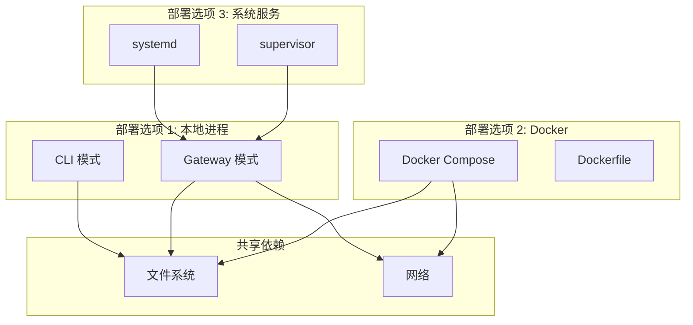
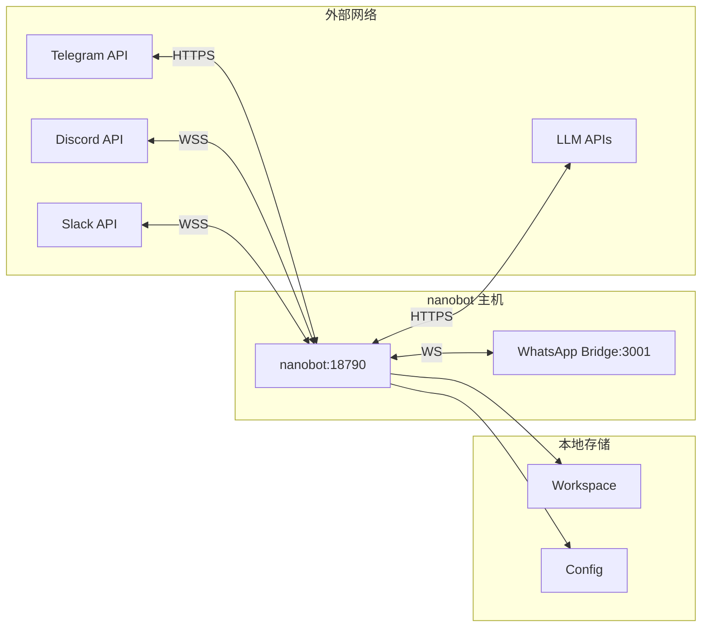

# Deployment View

## 部署模式

**[FACT]** nanobot 支持 3 种部署模式：

### 1. 本地 CLI 模式

```bash
# 单次执行
nanobot agent -m "Hello"

# 交互模式
nanobot agent
```

**特点**:
- 单进程
- 无 channel
- 直接终端交互
- 适合开发测试

### 2. Gateway 模式

```bash
nanobot gateway
```

**特点**:
- 长运行进程
- 多 channel 支持
- 后台服务
- 适合生产部署

### 3. Docker 容器

```bash
docker-compose up -d
```

**特点**:
- 容器化
- 易于部署
- 环境隔离

## 部署架构图



## Docker 部署

**[FACT]** 从 `Dockerfile` 和 `docker-compose.yml`:

### Dockerfile

```dockerfile
FROM python:3.11-slim

WORKDIR /app

# 安装依赖
COPY pyproject.toml .
RUN pip install -e .

# 复制代码
COPY nanobot/ nanobot/
COPY bridge/ bridge/

# 暴露端口
EXPOSE 18790

CMD ["nanobot", "gateway"]
```

### docker-compose.yml

```yaml
version: '3.8'

services:
  nanobot:
    build: .
    ports:
      - "18790:18790"
    volumes:
      - ./workspace:/root/.nanobot/workspace
      - ./config.json:/root/.nanobot/config.json
    environment:
      - NANOBOT_PROVIDERS__OPENAI__API_KEY=${OPENAI_API_KEY}
    restart: unless-stopped
```

## 系统服务部署

**[INFERENCE]** systemd 配置示例：

### systemd Unit

```ini
[Unit]
Description=nanobot AI Assistant
After=network.target

[Service]
Type=simple
User=nanobot
WorkingDirectory=/home/nanobot
ExecStart=/usr/local/bin/nanobot gateway
Restart=on-failure
RestartSec=10

Environment="NANOBOT_PROVIDERS__OPENAI__API_KEY=sk-..."

[Install]
WantedBy=multi-user.target
```

### 管理命令

```bash
sudo systemctl start nanobot
sudo systemctl enable nanobot
sudo systemctl status nanobot
sudo journalctl -u nanobot -f
```

## 网络拓扑

**[FACT]** Gateway 模式网络图：



## 资源需求

**[INFERENCE]** 基于架构估算：

### 最小配置

- **CPU**: 1 核
- **内存**: 512 MB
- **磁盘**: 1 GB
- **网络**: 稳定互联网连接

### 推荐配置

- **CPU**: 2 核
- **内存**: 2 GB
- **磁盘**: 10 GB (session 存储)
- **网络**: 低延迟连接

### 扩展限制

**[FACT]** 单进程架构限制：
- 无水平扩展
- 垂直扩展受限于单机资源
- 并发受全局锁限制

## 高可用性

**[INFERENCE]** nanobot 不支持 HA：

### 单点故障

- 进程崩溃 = 服务中断
- 无自动故障转移
- 无状态复制

### 缓解措施

1. **进程监控**
   - systemd 自动重启
   - supervisor 监控

2. **数据备份**
   ```bash
   # 定期备份 workspace
   rsync -av ~/.nanobot/workspace/ /backup/
   ```

3. **健康检查**
   ```bash
   # 简单检查
   ps aux | grep nanobot
   ```

## 升级策略

**[FACT]** 升级流程：

### 1. 停止服务

```bash
sudo systemctl stop nanobot
```

### 2. 备份数据

```bash
cp -r ~/.nanobot/workspace ~/.nanobot/workspace.backup
cp ~/.nanobot/config.json ~/.nanobot/config.json.backup
```

### 3. 升级软件

```bash
pip install --upgrade nanobot-ai
```

### 4. 刷新配置

```bash
nanobot onboard
```

### 5. 启动服务

```bash
sudo systemctl start nanobot
```

## 多实例部署

**[OPEN QUESTION]** 是否支持多实例？

**[INFERENCE]** 不推荐：
- 共享 workspace 会冲突
- 无分布式锁
- Session 文件竞争

**可能方案**:
- 不同 workspace 目录
- 不同端口
- 不同 channel 集合
