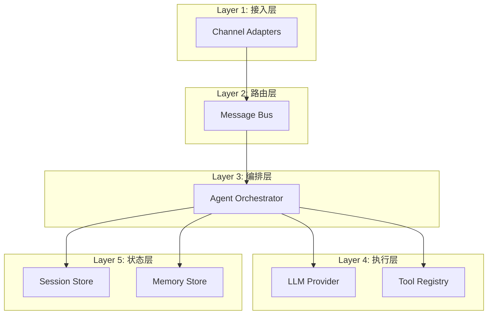

# Reusable AgentOS Blueprint

## 从 nanobot 提取的通用 AgentOS 模式

**[INFERENCE]** 基于 nanobot 分析，提炼可复用的 AgentOS 设计蓝图。

## 核心层次架构



## 通用层 vs nanobot 特定实现

| 层次 | 通用概念 | nanobot 实现 | 可替换性 |
|-----|---------|-------------|---------|
| 接入层 | Channel 抽象 | 11 个平台适配器 | ✅ 高 |
| 路由层 | 消息队列 | asyncio.Queue | ✅ 高 |
| 编排层 | Agent Loop | AgentLoop 类 | ⚠️ 中 |
| LLM 层 | Provider 抽象 | LiteLLM + 自定义 | ✅ 高 |
| 工具层 | Tool 接口 | 9 个内置工具 | ✅ 高 |
| 状态层 | Session 管理 | JSONL 文件 | ✅ 高 |
| 记忆层 | Memory 系统 | Markdown 文件 | ⚠️ 中 |

## 可复用的设计模式

### 1. Channel 适配器模式

**通用接口**:
```python
class Channel(ABC):
    async def start()
    async def stop()
    async def send(message)
    def is_authorized(user_id) -> bool
```

**适用场景**: 任何需要多平台接入的 AgentOS

### 2. Message Bus 解耦

**通用模式**:
```
Channel → Inbound Queue → Agent → Outbound Queue → Channel
```

**适用场景**: 需要异步处理、多 channel 的系统

### 3. Tool Registry 模式

**通用接口**:
```python
class Tool(ABC):
    name: str
    description: str
    parameters: JSONSchema
    async def execute(**kwargs) -> str
```

**适用场景**: 需要动态工具注册的 Agent 系统

### 4. Session 隔离模式

**通用概念**:
- Session Key = `{channel}:{context_id}`
- 每个 session 独立状态
- 追加式历史

**适用场景**: 多用户、多上下文的对话系统

### 5. Memory 整合模式

**通用流程**:
1. 检测上下文窗口压力
2. LLM 总结旧消息
3. 提取到结构化存储
4. 标记已整合

**适用场景**: 需要长期记忆的 Agent

## 面向办公场景的 AgentOS 设计

**[INFERENCE]** 如果要做"Work Agent OS"，可以沿用和需要重做的部分：

### 可沿用的层

1. **Channel 层** (80% 可复用)
   - 保留: Slack, Email, Teams
   - 新增: Zoom, Google Meet, Notion

2. **Message Bus** (100% 可复用)
   - 相同的异步队列模式

3. **Tool 抽象** (100% 可复用)
   - 相同的 Tool 接口

4. **Provider 层** (100% 可复用)
   - 相同的 LLM 抽象

### 需要重做的层

1. **工具集** (需要重新设计)
   - 办公工具: Calendar, Email, Document
   - 协作工具: Jira, Confluence, GitHub
   - 数据工具: SQL, API, Spreadsheet

2. **权限系统** (需要增强)
   - 多租户隔离
   - RBAC
   - 审计日志

3. **状态存储** (需要升级)
   - 数据库替代文件系统
   - 事务支持
   - 查询能力

4. **编排逻辑** (需要扩展)
   - 工作流支持
   - 审批流程
   - 定时任务增强

## AgentOS 核心能力清单

**[INFERENCE]** 任何 AgentOS 应具备的核心能力：

### 必备能力

- ✅ 多 channel 接入
- ✅ LLM 集成
- ✅ Tool 执行
- ✅ Session 管理
- ✅ 异步处理

### 推荐能力

- ✅ Memory 系统
- ✅ 定时任务
- ⚠️ 子任务分发
- ⚠️ 主动行为

### 可选能力

- ❌ 多租户
- ❌ 工作流引擎
- ❌ 可观测性
- ❌ 高可用

## 实现复杂度估算

**[INFERENCE]** 基于 nanobot 的经验：

| 组件 | 代码量 | 复杂度 | 时间估算 |
|-----|--------|--------|---------|
| Message Bus | 100 行 | 低 | 1 天 |
| Channel 基础 | 200 行 | 中 | 2 天 |
| 单个 Channel | 300 行 | 中 | 3-5 天 |
| Agent Loop | 500 行 | 高 | 1 周 |
| Tool 系统 | 300 行 | 中 | 3 天 |
| Session 管理 | 200 行 | 中 | 2 天 |
| Memory 系统 | 300 行 | 高 | 1 周 |
| Config 系统 | 500 行 | 中 | 3 天 |
| CLI | 900 行 | 中 | 1 周 |

**MVP 估算**: 4-6 周（单人）
**完整系统**: 3-4 月（单人）

## 技术栈建议

### Python 生态

**优势**:
- 丰富的 AI/ML 库
- asyncio 成熟
- 快速开发

**劣势**:
- 性能受限
- 部署复杂

### Go 生态

**优势**:
- 高性能
- 并发原生支持
- 单二进制部署

**劣势**:
- AI 库较少
- 开发速度慢

### TypeScript 生态

**优势**:
- 全栈统一
- 生态丰富
- 类型安全

**劣势**:
- 运行时开销
- 内存占用高

**[INFERENCE]** 推荐：Python（快速原型）→ Go（生产优化）
